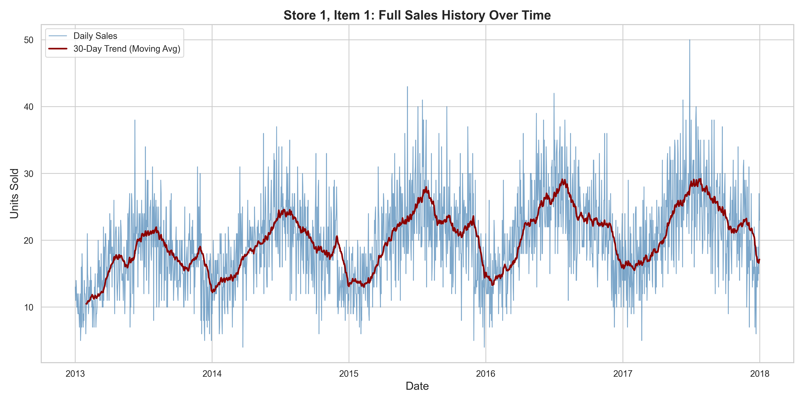
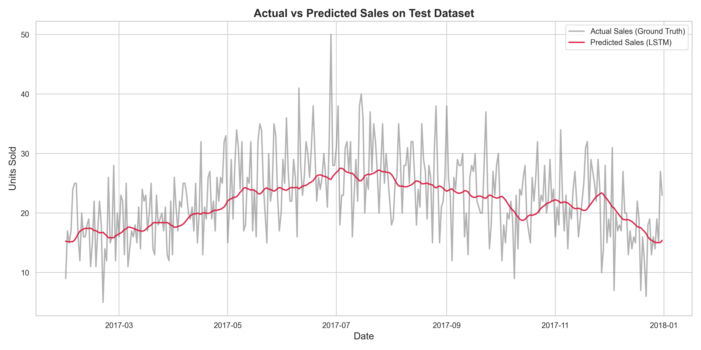
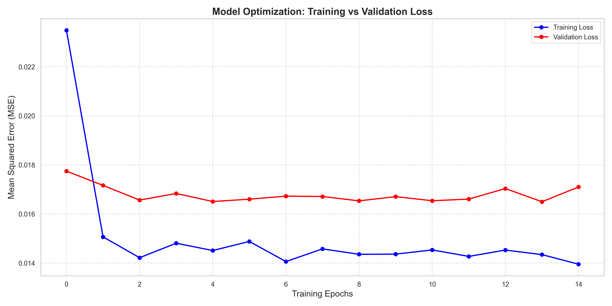
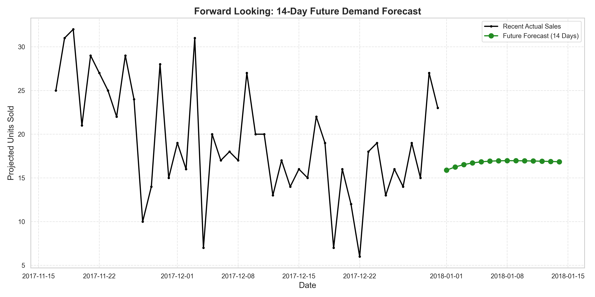

# Retail Demand Forecasting using LSTM 📈

## 📌 Project Overview
This project predicts future product demand (sales) using historical time-series data. Accurate demand forecasting is critical for retail businesses to optimize inventory, minimize stockouts, and reduce storage costs.

## 🎯 Problem Statement
Retailers often struggle to balance inventory. Ordering too much leads to high storage costs and wastage, while ordering too little leads to stockouts and lost revenue. The goal of this project is to build a highly accurate, automated forecasting model that can predict the next 14 days of sales for specific products across different stores.

## 📊 Dataset Description
The model is trained on a robust historical retail dataset.
* **File Structure:** Local `data/train.csv`
* **Size:** ~913,000 rows
* **Features:** 
  * `date`: The chronological date of the recorded sale.
  * `store`: Unique identifier for the retail store (1-10).
  * `item`: Unique identifier for the product (1-50).
  * `sales`: Target variable (units sold).

## 🧠 Approach & Model Explanation
This project utilizes a **Stacked Long Short-Term Memory (LSTM)** neural network. LSTMs are a specialized type of Recurrent Neural Network (RNN) designed specifically to understand sequences and time.

1. **Feature Engineering:** Extracted temporal features such as `day_of_week` and `month` to allow the model to explicitly learn weekly spikes and yearly seasonality (Multivariate approach).
2. **Scaling:** Data is scaled using `MinMaxScaler` into a `[0,1]` range for optimized neural network training.
3. **Sequence Creation:** A sliding window approach (`lookback=30`) is used. The model reads the last 30 days of features to predict Day 31.
4. **Architecture:**
   * Input Layer (30 time steps, 3 features)
   * LSTM Layer (64 units) + Dropout (0.2)
   * LSTM Layer (32 units) + Dropout (0.2)
   * Dense Output Layer (1 unit)

## 🏆 Results
The model demonstrates excellent predictive precision on the unseen test dataset:
* **Mean Absolute Error (MAE):** ≈ 4.2 units
* **Root Mean Squared Error (RMSE):** ≈ 5.3 units

*The model successfully captures long-term seasonality and trends, though it naturally smooths out extreme anomalous spikes, making it highly reliable for baseline inventory ordering.*

## 📈 Visualizations

### 1. Demand Forecasting Trend


### 2. Actual vs Predicted (Test Data)


### 3. Training Loss Curve


### 4. 14-Day Future Forecast


## 💼 Business Impact
* **Optimized Supply Chain:** Supply chain managers can order the exact stock required for the next two weeks.
* **Reduced Lost Sales:** Ensures high-demand products remain on shelves.
* **Lower Capital Lock-up:** Prevents over-ordering, freeing up capital for other business initiatives.

## ⚠️ Limitations & Future Improvements
* **Limitations:** The current model smooths out extreme spikes. It does not account for exogenous shock variables (e.g., sudden weather events, macroeconomic shifts).
* **Future Improvements:** 
  * Add promotional flags and holiday indicators to the dataset.
  * Scale to train a Global AI model capable of predicting all 50 items simultaneously without looping.
  * Integrate an automatic hyperparameter tuning pipeline using KerasTuner.

## 💻 Tech Stack
* **Python 3.x**
* **TensorFlow / Keras** (Deep Learning)
* **Pandas & NumPy** (Data Manipulation)
* **Scikit-Learn** (Preprocessing)
* **Matplotlib & Seaborn** (Data Visualization)

## 🚀 How to Run the Project

1. **Clone the repository:**
   ```bash
   git clone https://github.com/your-username/Retail_Demand_Forecasting.git
   cd Retail_Demand_Forecasting
   ```

2. **Set up a Virtual Environment:**
   ```bash
   python3 -m venv venv
   source venv/bin/activate  # On Windows: venv\Scripts\activate
   ```

3. **Install Dependencies:**
   ```bash
   pip install -r requirements.txt
   ```

4. **Add the Dataset:**
   Place your `train.csv` file inside the `data/` directory.

5. **Run the Models:**
   ```bash
   # Run the multivariate forecasting model
   python multivariate_demand_forecasting.py
   
   # Or generate all visualizations
   python generate_visualizations.py
   ```
